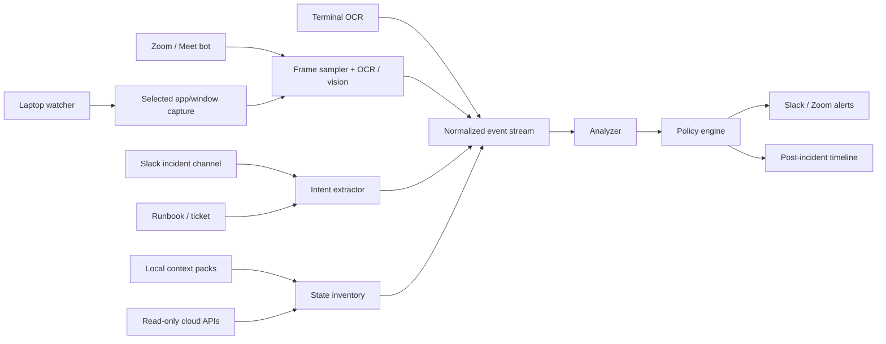

# OpsWatch Architecture

## Shape

## Event Stream

Adapters convert messy inputs into normalized observations:

- screen frame summaries
- command snippets
- speech transcript snippets
- runbook expectations
- read-only infrastructure state
- local context pack entries

The analyzer should not care whether a screen event came from Zoom, screenshots, browser automation, or a replay file.

## Current Vision Path

The current implementation has two entry points:

- `analyze-image`: analyze one screenshot/image
- `watch`: repeatedly capture the macOS full screen and analyze each frame

Both paths call a pluggable vision provider and ask for a normalized `screen` event. Supported providers:

- `openai`: OpenAI Responses API with image input
- `ollama`: local Ollama `/api/generate` with a vision model such as `llama3.2-vision`

That keeps the rest of the system model-agnostic: policies only see operational events, not raw images.

The next capture milestone is selected-window watching:

- list visible windows and apps
- let the operator choose Zoom, browser, terminal, or another app
- capture only that window
- skip frames when nothing materially changed
- keep raw images ephemeral unless debug retention is explicitly enabled

The current watcher already includes the first local-control pieces:

- resize before analysis
- visual hash-based unchanged-frame skipping
- duplicate alert cooldown
- temporary frame cleanup by default
- optional rectangle capture for watching only the operational part of the screen
- selected-window capture via macOS window id
- local context pack loading through `--context-dir`
- per-frame timing diagnostics for tuning local model performance

## macOS Menu Bar Companion

`macos/OpsWatchBar` is a native AppKit menu bar app. It:

- lists visible windows through CoreGraphics
- lets the user select the target window
- starts the bundled `opswatch watch --window-id <id>` binary in release builds, or `go run ./cmd/opswatch watch --window-id <id>` in local development
- writes watcher logs to `/tmp/opswatch-menubar.log`
- stops the watcher when requested or when the app quits

The packaged app includes the Go CLI and exposes model, timing, environment, optional intent, and context directory settings in the UI.

## Policy Engine

Policies evaluate each event against rolling incident state. State includes:

- latest stated intent
- expected runbook action
- environment/account/region hints
- protected domains and resources
- AWS account and service ownership from local context packs
- recent observed actions

## First Policies

DNS policy:

- detect hosted zone creation
- compare against record-change intent
- flag protected domains

Terminal policy:

- detect destructive commands
- increase severity in production
- flag broad selectors

Context policy:

- detect mutating actions in AWS accounts marked production by local context
- enrich alerts with account owner and environment

## Privacy Posture

OpsWatch should be designed so enterprise buyers can approve it:

- explicit bot participant
- incident-only activation
- ephemeral video processing
- no raw screen retention by default
- redact secrets from event summaries
- store structured timeline, not full recordings
